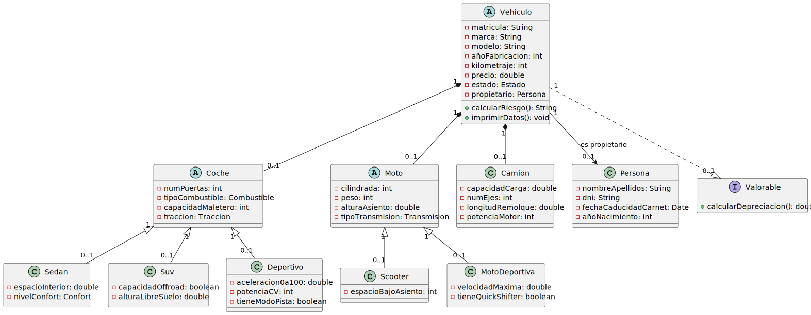

# UT5_ED_Prog

### ✔️ Checklist de Tareas:
- [x] Crear repositorio en GitHub
- [x] Añadir README.md con checklist
- [x] Crear estructura de carpetas
- [x] Modelar clases en PlantUML
- [x] Generar diagrama UML en .svg
- [x] Insertar diagrama en el README.md

